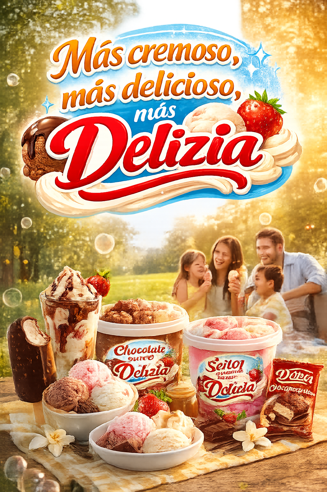

# Notas de Clase

## Proyecto: Desarrollo de Spot Publicitario con IA

### Objetivo del Proyecto

Diseñar y producir un **spot publicitario audiovisual de 10 segundos** utilizando herramientas de Inteligencia Artificial, incorporando elementos esenciales de marketing y producción audiovisual.

El spot debe transmitir emoción, identidad de marca y destacar el producto mediante recursos visuales y narrativos.

### Requisitos del Spot Publicitario

El spot debe incluir obligatoriamente:

* Un **lema publicitario**
* Un **logo representativo**
* Una **imagen base o escenario**
* **Animación o video generado con IA**
* Música de fondo
* Narración (voz en off opcional)

### Identidad de Marca

#### 🏷 Empresa

**Delizia** Empresa boliviana reconocida por la producción de helados y productos lácteos, asociada a momentos familiares y felicidad compartida.

### Lema Publicitario

> **“Más cremoso, más delicioso, más Delizia.”**

#### Intención del lema

* Resaltar la **textura cremosa**
* Destacar el **sabor superior**
* Reforzar el **nombre de la marca**
* Crear recordación mediante repetición

### Diseño del Logo

El logo fue diseñado con estilo moderno, colores vibrantes y elementos visuales asociados a cremosidad y frescura.


#### Elementos visuales

* Tipografía llamativa y amigable
* Colores cálidos (rojo, crema, amarillo)
* Elementos gráficos relacionados al helado

### Imagen Base / Escenario

Se generó una imagen cinematográfica que representa:

* Un parque en verano
* Una familia boliviana feliz
* Helados en primer plano
* Iluminación cálida (golden hour)



#### Características técnicas:

* Estilo cinematográfico
* Profundidad de campo
* Iluminación natural cálida
* Colores vibrantes
* Enfoque en textura del producto

### Prompt Utilizado para la Generación Visual

```text
10-second cinematic commercial, 4K quality. Warm summer afternoon in a green park in Bolivia. A happy Bolivian family enjoying Delizia ice cream together. Golden sunlight, vibrant colors, soft slow motion, emotional advertising style.

Scene 1 (0–3 sec): Close-up of ultra-creamy ice cream being served in slow motion. Smooth texture, sunlight shining on it. Text on screen: “Más cremoso…”

Scene 2 (3–7 sec): A little girl takes a bite and smiles with joy. The family laughs naturally in the background. Text on screen: “Más delicioso…”

Final Scene (7–10 sec): Wide shot of the family together. Logo appears in the center with warm golden glow.

On-screen text:
“Más cremoso, más delicioso, más Delizia.”

Background music: happy emotional summer commercial music.
Voice-over:
“Más cremoso, más delicioso… más Delizia.”
```

### Producción del Video con IA

#### Herramientas Utilizadas

con Grok 2 (Generación de Video)

Video 1

<video controls width="600">
  <source src="videos/grok_video1.mp4" type="video/mp4">
</video>

##### Video 2

<video controls width="600">
  <source src="videos/grok_video2.mp4" type="video/mp4">
</video>

con RunwayML

Plataforma utilizada:
**Runway**

##### Video generado

<video controls width="600">
  <source src="videos/runwayml.mp4" type="video/mp4">
</video>

### Elementos Audiovisuales Aplicados

#### Música

* Estilo emocional
* Ambiente familiar
* Ritmo alegre y cálido
* Sensación veraniega

#### Narración

Voz femenina suave y emocional:

> “Más cremoso, más delicioso… más Delizia.”

### Análisis Publicitario

#### Estrategia utilizada

* Marketing emocional
* Asociación producto-familia
* Refuerzo visual de textura
* Uso de iluminación cálida para generar sensación de bienestar

#### Público Objetivo

* Familias
* Niños
* Jóvenes
* Consumidores en temporada de verano

### Conclusión

El spot logra integrar:

* Identidad de marca
* Emoción familiar
* Enfoque visual en el producto
* Recordación del lema

Mediante el uso de herramientas de Inteligencia Artificial se optimizó el proceso de producción audiovisual, permitiendo generar imágenes y videos de calidad profesional en menor tiempo.

